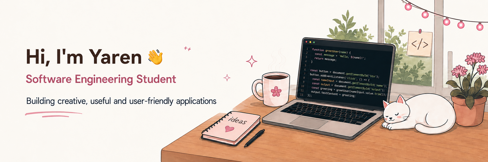

README_UPDATED.md

  

 

🌸 About Me
🎓 I’m a fourth-year Software Engineering student based in Türkiye.

💻 I enjoy turning ideas into clean, useful and user-friendly applications.

🎮 I have developed games and gameplay mechanics using Unity and C#.

🌐 I have built full-stack web applications with React and Spring Boot.

🧠 I have worked on data structures and algorithms, relational databases and data validation.

🤖 I have developed artificial intelligence projects using Python and TensorFlow.

✨ I’m open to internship opportunities, collaboration and new challenges.

🛠️ Technologies & Tools

  

 

  Java • C# • Python • JavaScript • HTML • CSS • Spring Boot • React • Bootstrap • TensorFlow • Unity • PostgreSQL • Docker • Git • GitHub • VS Code  

🌱 Currently Learning
Advanced Spring Boot and backend development

System design and distributed systems

Deep learning with TensorFlow

Game development with Unity

Professional and technical English

✨ Featured Projects

Coming Soon ✨
I’m currently preparing projects that combine creativity, technology and real-world problem solving.

📊 GitHub Activity

  

💌 Let’s Connect

 &nbsp;&nbsp;&nbsp; &nbsp;&nbsp;&nbsp;  

 

 <em>Creating, learning and growing — one commit at a time. 🌱</em> 

